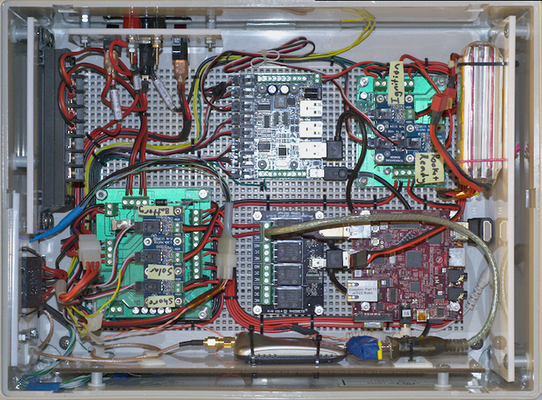
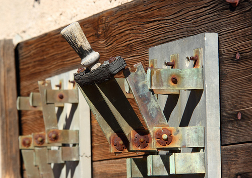
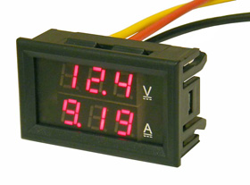

PSAS LTC III Requirements Discussion
====================================
:author:  Paul Mullen
:date: 12 Jan 2015
:copyright:  2015 Portland State Aerospace Society
:backend:  slidy
:max-width: 33em
:data-uri:

Tonight's Agenda
----------------

_What_, Not _How_

* LTC II Review
* LTC III Requirements
* LTC III Wish List

LTC II: The Good
----------------

Smaller and less heavy than LTC I

[[image-ltc_i]]
.The guts of LTC I
image::images/LTC_I.jpeg[]

LTC II: The Good
----------------

* Solar charging
* Lithium polymer ignition battery

[[image-ltc_ii_lipo_ignition_battery_pack]]
.LTC III ignition board and LiPo battery pack.
image::images/LTC_II_LiPo_Ignition_Battery_Pack.jpeg[]

LTC II: The Not So Good
-----------------------

* Still big and bulky
* Complicated + heavily mod-wired = difficult to work on 

[[image-ltc_ii]]
.The guts of LTC II

LTC II: The Not So Good
-----------------------

* Lead-acid main batteries (heavy and bulky)
* Phidgets

[[image-ltc_ii_phidgets]]
.LTC II Phidgets interface board.
image::images/LTC_II_Phidget_Interface_Board.jpeg[Photo of LTC II's Phidgets interface board.]

LTC II: The Not So Good
-----------------------

* Inadequate shore power DC-DC converter

[[image-ltc_ii_power_board]]
.LTC II power board.
image::images/LTC_II_Power_Board.jpeg[Photo of LTC II's power supply board.]

LTC II: The Not So Good
-----------------------

* Ignition shorting bar sockets interfere with bulkhead access door

[[image-ltc_ii_bulkhead_door]]
.LTC II bulkhead access door.
image::images/LTC_II_Bulkhead_Door.jpeg[Photo of LTC II's bulkhead access door.]

LTC II: The Not So Good
-----------------------

* External power connectors are difficult to access

[[image-ltc_ii_power_connectors]]
.LTC II external power connectors.
image::images/LTC_II_Power_Connectors.jpeg[Photo of LTC II's power connectors.]

LTC III Goals
-------------

* Simplify!  Too many boards, too many wires, too many everything.
* Shrink it!
* Transparent State
* Make it user-friendly (i.e., fool-proof).
* Use field-replaceable units (FRU) whenever possible.

Known Requirements
------------------

* Power Sources
* Power Supplies
* Networking
* Sensors
* User Interface
* External Connectors

Power Sources
-------------

Where the juice comes from.

* (10, 14.4, 16.8) VDC from main batteries
** Internal; permanent.
** Sufficient capacity to source internal and external loads (~4 AH)

* (10, 12, 17) VDC from photovoltaic ("PV") panels
** External.

* max 24 VDC lab power connection (while not in the field)
** External; separate from PV input.
** ThinkPad switching "pregnant snake" power supply: 19 V, several A

Power Supplies
--------------

Juice the LTC provides.

* 5 VDC for computer power, etc.
** TODO: power/current requirement... ~10 W

* 12-15 VDC for ignition battery charger
** Assuming a buck/boost battery charger, else > 14.7 V
** NOT integral to LTC. Separate system.
** COTS, not a custom design!

* 19 VDC @ 4 A for rocket shore power
** LTC2 was browning out @ 2 A; replacement converter is 4 A

Power Loads
-----------

Who the juice goes to.

* Several external expansion power connectors
** Switchable by the computer

Relays
------

* Internal: ignition

* External: expansion peripherals
** Power connectors
** Switch across input pair (no power)
*** Opto-isolated

Networking
----------

* WiFi connection to Launch Control.

* Internal Ethernet switch
** LTC computer; rocket; external (debug, expansion peripherals)

Sensors
-------

* Voltage sensors for each power rail.
** 5 VDC; 19 VDC; main battery; ignition battery; PV; lab

* Temperature sensors
** Board; main battery pack; enclosure interior

* Ignition fuse state

* Umbilical connection state

* Current consumption
** PV; battery; rocket

* Rocket-ready status

User Interface
--------------

[[image-rusty_knife_switch]]

* Main power switch

* Ignition arming switch.

* Ignition shorting bar.

* Ignition fuse.

User Interface
--------------

[[image-panel_dmm]]

* Front panel voltmeters for each power rail.
** Activated by momentary push-button.
** Independent of SBC.  Useful for debug.
** IDEA: an entire LCD display driven by the SBC.  If the SBC can't come
   up, independent meters aren't worth much.
*** On panel; acrylic shield; sun shade.
** IDEA: keep the panel DMM, unconnected, for debug use
** IDEA: scrap the panel DMM, include a real DMM for debug (internally mounted)

* Front panel LEDs indicating the status of each relay, and the
  rocket-ready status.
** relays; triggers
** must be daylight-readable (shrouded?)

* Label all the things!  Components, connectors, switches, oh my!

External Connections
--------------------

* Power In
** solar panels
** lab (AKA "shore shore")

* Rocket umbilical
** Ethernet, shore power, rocket-ready

* Away box

* WiFi coax to external antenna

* Expansion support
** Power connectors
** Ethernet connectors to internal subnet
** Trigger switches

Wish List
---------

* Improved enclosure.
** Smaller; metal.
** IDEA: narrow (tower width); shoebox-ish size
** Metal more robust; RF proof.  May soak up more solar heat.
** IDEA: Pelican case. Handles!
** Lay-flat-able!
*** At least one side free of protuberances.

* Improved enclosure-to-tower mounting apparatus

* Andrew strongly suggests a single-board LTC3.
** Lots of Maxim Test Points along traces between sub-systems.

* Multiple backup LTCs.

* Prototyping area
** 0.1" hole grid; off-board connectors

Schedule
--------

* 27 Jan: Requirements Review & Freeze (last call!)
* late Feb, early March: Design Review #1
** Level 2 block diagram
** Interconnects
** Schematics
** Preliminary BOM
